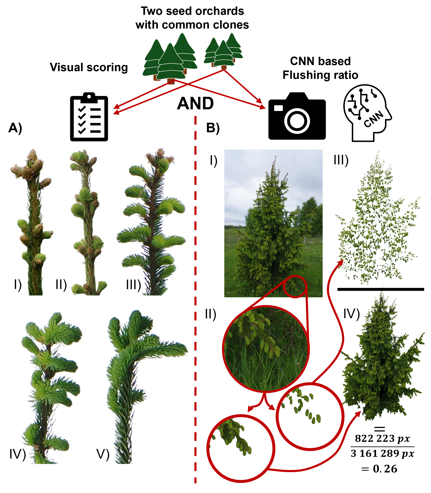

# 🌲 Flushing Ratio – CNN-based Quantification of Spring Bud Phenology

Deep learning–aided RGB phenotyping framework for objective quantification of spring bud flushing in *Picea abies* (Norway spruce).

This repository contains the full computational pipeline for calculating **Flushing Ratio (FR)** from high-resolution field images using CNN-based instance segmentation, and for estimating genetic parameters (heritability, G×E, genetic correlations) based on the derived phenotypic traits.

---

## 📌 Methodology

  

**Figure 1.** Conceptual overview of the workflow.  
A) Traditional ordinal visual scoring (Krutzsch stages).  
B) CNN-based segmentation approach leading to calculation of Flushing Ratio (FR).

---

## 🎯 Project Overview

Spring bud flushing is a key adaptive trait in forest genetics.  
Traditional assessment relies on subjective ordinal scoring, which introduces observer bias and discretization effects.

This project introduces a **structure-based, CNN-derived phenomic trait**:

### **Flushing Ratio (FR)**

$FR = \frac{BA}{RA}$

where:

- **BA** – Budburst Area (light-green flushing tissues)
- **RA** – Ramet Area (entire visible crown)

FR is derived from automated instance segmentation using YOLOv11 and provides:

- Continuous phenotypic measurement
- Observer-independent quantification
- Higher heritability compared to ordinal scoring
- Stable clonal ranking across environments

---

## 🧠 Biological Context

The framework was developed for:

- Two Norway spruce seed orchards
- Common clones across contrasting environments
- Multi-year phenological monitoring
- Quantitative genetic analysis

The goal is to evaluate how phenotyping method influences:

- Broad-sense heritability (H²)
- Type B genetic correlations (G×E)
- Cross-method genetic consistency

---

## 🤖 CNN-Based Image Analysis

- Model: **YOLOv11 instance segmentation**
- Classes:
  - `norway-spruce` (entire ramet)
  - `spruce-bud` (light-green flushing tissues)
- Tile-based inference (600×600 px with offsets)
- COCO RLE mask stitching
- Logical mask operations
- Color-threshold refinement
- Pixel-based ratio computation

Detailed model training and evaluation metrics are available in [weights](weights)

Detailed workflow of calculation Flushing Ratio is available in [code/Data_processing](code/Data_Processing)

Detailed statistical analysis is available in [code/Statistical_Analysis](code/Statistical_Analysis)

